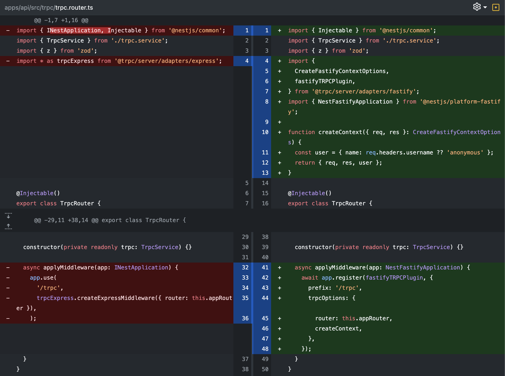
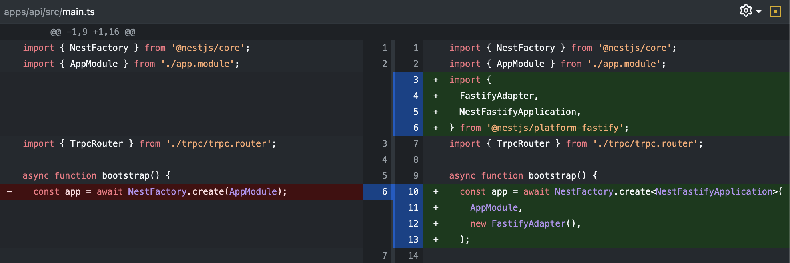

# Memo

## Environment setup

### Start NestJS app

Install pnpm.

```shell
npm i -g pnpm@latest
```

Create a new repo.

```shell
pnpm dlx create-turbo@latest
```

Install NestJS CLI.

```shell
pnpm i -g @nestjs/cli
```

Create a new NestJS app.

```shell
nest new apps/api --strict --skip-git --package-manager pnpm
```

### Setup tRPC

Install tRPC server.

```shell
pnpm i @trpc/server zod --filter=api
```

Create NestJS tRPC module.

```shell
cd apps/api
nest generate module trpc
nest generate service trpc
```

Install tRPC into client.

```shell
pnpm i @trpc/client @trpc/server --filter=web
```

#### References

- [Ultimate Guide: NextJS, NestJS & TRPC Monorepo [Updated 2023]](https://www.tomray.dev/nestjs-nextjs-trpc)
  - How to setup tRPC in NestJS

### Migrate to fastify

Remove express.

```shell
pnpm remove @nestjs/platform-express @types/express --filter=api
```

Install fastify.

```shell
pnpm i fastify @nestjs/platform-fastify --filter=api
```

Install tRPC fastify adapter.

```shell
pnpm i @trpc/server zod fastify --filter=api
```

apps/api/src/trpc/trpc.router.ts



apps/api/src/main.ts



#### References

- [Performance (Fastify) | NestJS](https://docs.nestjs.com/techniques/performance)
  - How to use fastify in NestJS
- [Cookies | NestJS](https://docs.nestjs.com/techniques/cookies)
  - How to register fastify plugins in NestJS
- [Fastify Adapter | tRPC](https://trpc.io/docs/server/adapters/fastify)
  - How to use tRPC fastify adapter

---

# Turborepo starter

<details>
<summary>contents</summary>
<div>

This is an official starter Turborepo.

## Using this example

Run the following command:

```sh
npx create-turbo@latest
```

## What's inside?

This Turborepo includes the following packages/apps:

### Apps and Packages

- `docs`: a [Next.js](https://nextjs.org/) app
- `web`: another [Next.js](https://nextjs.org/) app
- `@repo/ui`: a stub React component library shared by both `web` and `docs` applications
- `@repo/eslint-config`: `eslint` configurations (includes `eslint-config-next` and `eslint-config-prettier`)
- `@repo/typescript-config`: `tsconfig.json`s used throughout the monorepo

Each package/app is 100% [TypeScript](https://www.typescriptlang.org/).

### Utilities

This Turborepo has some additional tools already setup for you:

- [TypeScript](https://www.typescriptlang.org/) for static type checking
- [ESLint](https://eslint.org/) for code linting
- [Prettier](https://prettier.io) for code formatting

### Build

To build all apps and packages, run the following command:

```
cd my-turborepo
pnpm build
```

### Develop

To develop all apps and packages, run the following command:

```
cd my-turborepo
pnpm dev
```

### Remote Caching

Turborepo can use a technique known as [Remote Caching](https://turbo.build/repo/docs/core-concepts/remote-caching) to share cache artifacts across machines, enabling you to share build caches with your team and CI/CD pipelines.

By default, Turborepo will cache locally. To enable Remote Caching you will need an account with Vercel. If you don't have an account you can [create one](https://vercel.com/signup), then enter the following commands:

```
cd my-turborepo
npx turbo login
```

This will authenticate the Turborepo CLI with your [Vercel account](https://vercel.com/docs/concepts/personal-accounts/overview).

Next, you can link your Turborepo to your Remote Cache by running the following command from the root of your Turborepo:

```
npx turbo link
```

## Useful Links

Learn more about the power of Turborepo:

- [Tasks](https://turbo.build/repo/docs/core-concepts/monorepos/running-tasks)
- [Caching](https://turbo.build/repo/docs/core-concepts/caching)
- [Remote Caching](https://turbo.build/repo/docs/core-concepts/remote-caching)
- [Filtering](https://turbo.build/repo/docs/core-concepts/monorepos/filtering)
- [Configuration Options](https://turbo.build/repo/docs/reference/configuration)
- [CLI Usage](https://turbo.build/repo/docs/reference/command-line-reference)

</div>
</details>
